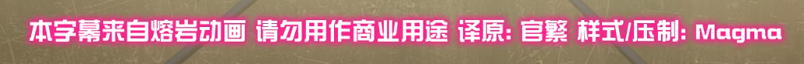
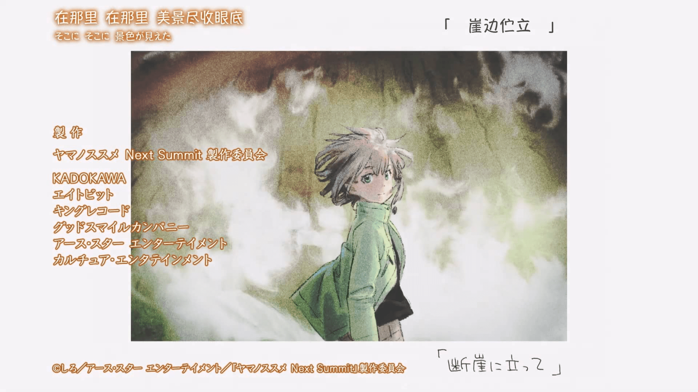
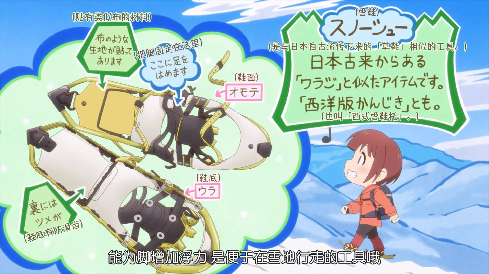

# 字幕的制作流程

本文带您了解本组的字幕是如何制作的。

## 二改字幕的译文修改工作

二改字幕是本组的主要作品类型。为避免观众将这种字幕和传统字幕组作品混为一谈，我们使用 **熔岩动画搬运（LavaAnime）** 的名义发布二改字幕。

这种二改字幕使用番剧官方或流媒体平台的中文译文，然后在此基础上增加字幕样式、屏幕字、歌词特效和歌词翻译等。

制作二改字幕时，我们不会无脑照搬已有的汉语字幕，因为官方字幕由于种种原因，其时间轴、译制风格可能并不符合中国大陆普通话习惯，因此修改它们也成为了二改字幕必要的工作。

## Staff 表

Staff 表记录了参与制作字幕的人员。目前本组的 Staff 表通常可能放在以下几个位置：

- **本集的标题页**（番剧开场动画结束后出现的单独画面或屏幕字）
- **番剧片尾的制作委员会页**

_本组 派对浪客诸葛孔明 和 街角魔族 2 丁目 的 Staff 表_

## 歌词特效和歌词翻译

尽管很多官方字幕提供了歌词翻译，但是其质量一般，简单的直译较多。

歌词一般不忠于文字的字面意义，而是包含了一些暗示和双关，或是情感的表达。

如果时间允许，我们将重置歌词翻译，同时为歌词加上日文原文，加上一些简单的歌词样式特效。

_本组 向山进发 Next Summit 第四季 的歌词_

## 屏幕字

（厨力足够的情况下）我们会制作画面中的文字翻译，也就是“屏幕字”，争取更好的观看体验。

由于时间原因，屏幕字样式达到简洁美观即可，不追求复杂样式和动态跟踪字幕的制作。

_本组 向山进发 Next Summit 第四季 的屏幕字_

## 压制与封装

2022 年 4 月起新发布的资源均会被压制。MP4 通常为 AVC 8bit AAC 内嵌字幕，MKV 通常为 HEVC 10bit AAC 内封字幕。

影响到观看体验的错误会在发现后发布 V2，一般情况下会在合集补全。

> 我们目前全部节点使用 qBittorrentEE 进行做种，默认屏蔽了迅雷，请尽量使用正规 BT 软件进行下载。

## 关于二次发布或修改

[请参考此处](./index.md#搬运转载)

## 强迫症

这是选字体和做字幕的哲学。（大概）

比如你看，这个文档里的英文和中文之间都有一个空格。
